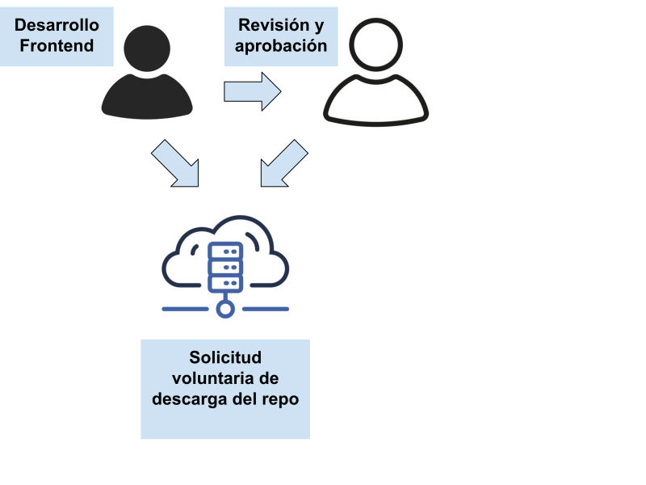
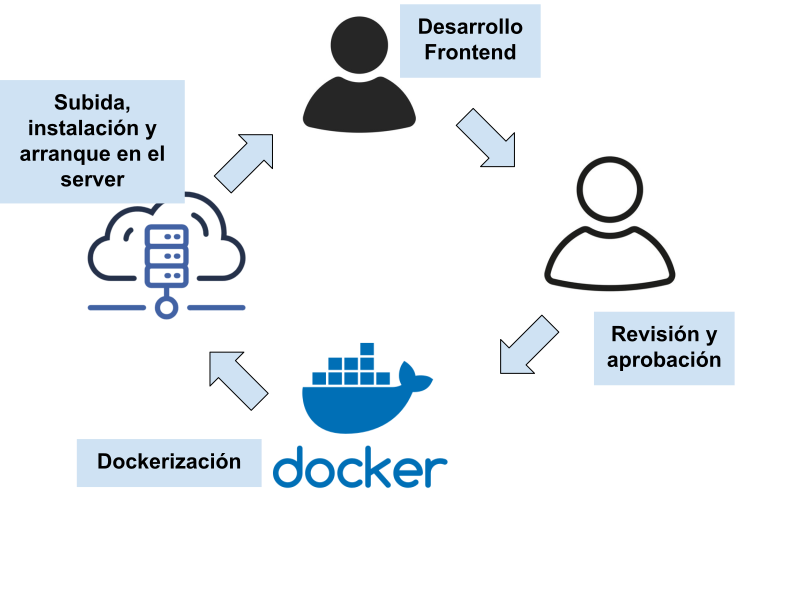

# Wrapper Frontend Fyxtoken

<p align="center">
  
</p>

<p align="center">
   
</p>

## Descripción

Servicio backend en NestJS que:
- Sirve la aplicación React compilada desde la carpeta `public`.
- Proporciona el endpoint **POST /api/app/get-front/sudo/{secretKey}** que sincroniza la última build del frontend remoto.
- Expone documentación Swagger UI en **/docs**.
- Soporta CORS, validación global y manejo de peticiones grandes (límite 50MB).
- Pendiente: implementación de socket.io para websockets en el cliente.

## 🔗 Previsualizaciones

- Swagger Docs: http://localhost:3000/docs  

## 📦 Instalación y ejecución

```bash
# Clonar repo
git clone https://github.com/Jeff-Aporta/wraper-front-fyxtoken.git

cd wraper-front-fyxtoken

# instala dependencias y descarga la build del frontend (Ejecutar una vez)
npm run deploy-build

# Inicia el servidor en producción (Ejecutar cada vez que se quiera iniciar el servidor)
npm run deploy-start
```  

## 🎯 Endpoints REST

| Método | Ruta                   | Descripción                               |
|--------|------------------------|-------------------------------------------|
| POST   | /api/app/get-front/sudo/{secretKey}     | Actualiza la carpeta `public` con la última build del frontend |

---

<h1>Con Wrapper</h1>
<br/>

<h1>Sin Wrapper</h1>
<br/>
